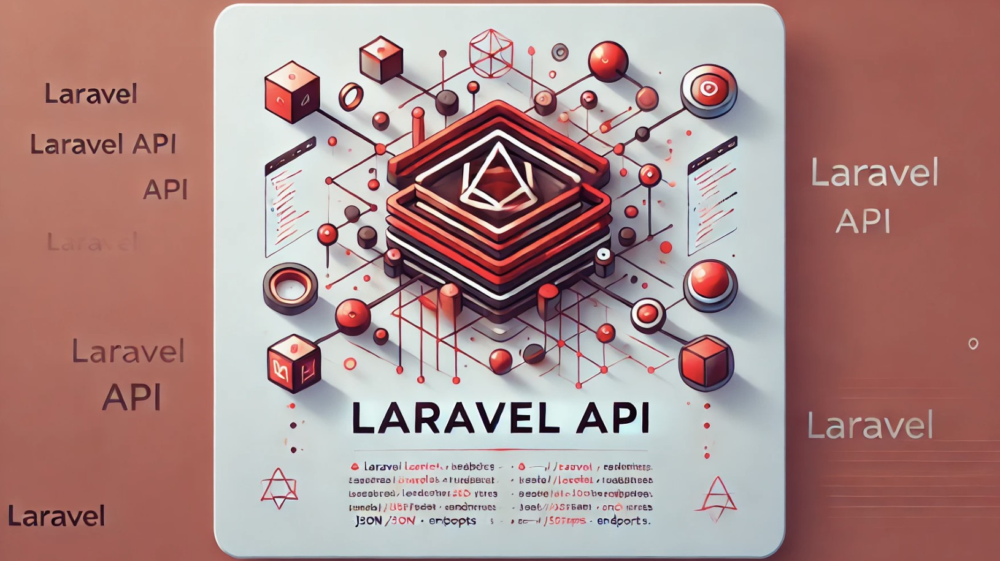

<p align="center">
    <a href="#" target="_blank">
        
    </a>
</p>

# Banking API

Este repositório consiste em uma API REST para gerenciamento de contas bancárias.

**IMPORTANTE: Este é um projeto utilizado para efeito de estudos pessoais!**

### Documentação

Para mais detalhes sobre os requisitos e regras de negócio, veja a [documentação](.doc/) do projeto. 

### Tecnologias utilizadas

- PHP 8.2+
- Composer 2
- Laravel 12
- MySQL 8
- PHPUnit
- PHP CS Fixer(via Laravel Pint)
- Docker (via Laravel Sail)

## Configuração do Ambiente

Siga estas instruções para configurar o ambiente de desenvolvimento:

### Pré-requisitos

Certifique-se de ter instalado:

- [Docker v28+](https://docs.docker.com/engine/install/)
- [Docker Compose](https://docs.docker.com/compose/)

### Passos para instalação

1. Configure o arquivo `.env`:

   ```bash
   cp .env.example .env
   ```

2. Suba os containers Docker:

   ```bash
   ./sail up -d
   ```

3. Instale as dependências do Composer:

   ```bash
   ./sail composer install
   ```

4. Gere a chave da aplicação Laravel:

   ```bash
   ./sail artisan key:generate
   ```

5. Execute as migrations:

   ```bash
   ./sail artisan migrate
   ```

6. Reinicie os containers:

   ```bash
   ./sail restart
   ```
---

> A API estará disponível em http://localhost/api.

## Qualidade de código

### Testes

Para rodar os testes automatizados, execute:

```bash
./sail test --coverage
```

### Code Standards Fixer

Para verificar e corrigir padrões de sintaxe, execute:

```bash
./sail pint
```

---
